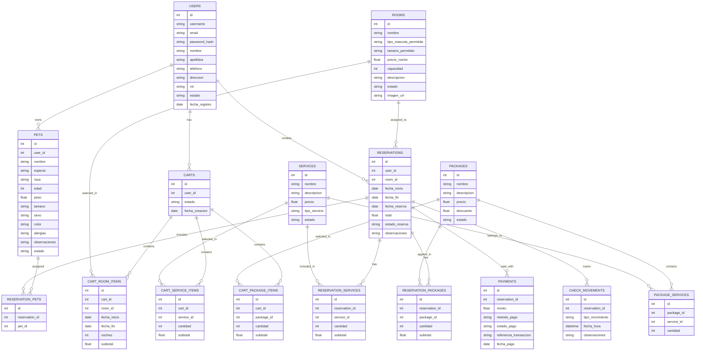
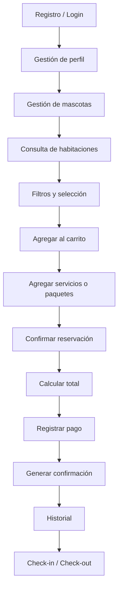

# Peludópolis

Plataforma web para la gestión de un hotel para mascotas.  
El sistema permitirá a los clientes registrar su cuenta, administrar la información de sus mascotas, consultar habitaciones y servicios, armar una reservación, realizar pagos y consultar su historial.  
Además, contará con un panel administrativo para la gestión de usuarios, habitaciones, servicios, paquetes, reservaciones y movimientos de check-in/check-out.

---

## Tabla de contenido

- [Peludópolis](#peludópolis)
  - [Tabla de contenido](#tabla-de-contenido)
  - [1. Descripción del proyecto](#1-descripción-del-proyecto)
  - [2. Objetivo general](#2-objetivo-general)
  - [3. Objetivos específicos](#3-objetivos-específicos)
  - [4. Alcance del proyecto](#4-alcance-del-proyecto)
    - [Alcance funcional del MVP](#alcance-funcional-del-mvp)
    - [Fuera de alcance inicial](#fuera-de-alcance-inicial)
  - [5. Stack tecnológico](#5-stack-tecnológico)
    - [Frontend](#frontend)
    - [Backend](#backend)
    - [Base de datos](#base-de-datos)
    - [Herramientas de desarrollo](#herramientas-de-desarrollo)
  - [6. Arquitectura general](#6-arquitectura-general)
    - [Enfoque arquitectónico](#enfoque-arquitectónico)
  - [7. Estructura del repositorio](#7-estructura-del-repositorio)
  - [8. Módulos del sistema](#8-módulos-del-sistema)
    - [Módulos para cliente](#módulos-para-cliente)
    - [Módulos para administrador](#módulos-para-administrador)
  - [9. Reglas de negocio clave](#9-reglas-de-negocio-clave)
  - [10. Modelo de datos preliminar](#10-modelo-de-datos-preliminar)
    - [Entidades principales](#entidades-principales)
    - [Diagrama entidad-relación preliminar](#diagrama-entidad-relación-preliminar)
  - [11. Flujo principal del sistema](#11-flujo-principal-del-sistema)
  - [12. Metodología de trabajo](#12-metodología-de-trabajo)
    - [Estrategia de ramas](#estrategia-de-ramas)
    - [Flujo de trabajo](#flujo-de-trabajo)
    - [Enfoque de trabajo en equipo](#enfoque-de-trabajo-en-equipo)
  - [13. Convenciones de desarrollo](#13-convenciones-de-desarrollo)
    - [Convención de commits](#convención-de-commits)
    - [Convención de nombres de archivos en backend](#convención-de-nombres-de-archivos-en-backend)
    - [Convención por capas](#convención-por-capas)
  - [14. Roadmap por fases](#14-roadmap-por-fases)
    - [Fase 1 - Base del proyecto](#fase-1---base-del-proyecto)
    - [Fase 2 - Autenticación y usuarios](#fase-2---autenticación-y-usuarios)
    - [Fase 3 - Mascotas y catálogo](#fase-3---mascotas-y-catálogo)
    - [Fase 4 - Carrito y reservaciones](#fase-4---carrito-y-reservaciones)
    - [Fase 5 - Pagos y seguimiento](#fase-5---pagos-y-seguimiento)
    - [Fase 6 - Administración y cierre](#fase-6---administración-y-cierre)
  - [15. Estado actual del proyecto](#15-estado-actual-del-proyecto)
  - [Notas de diseño importantes](#notas-de-diseño-importantes)
  - [Licencia](#licencia)

---

## 1. Descripción del proyecto

**Peludópolis** es una aplicación web enfocada en un hotel para mascotas.  
A diferencia de plataformas genéricas, este proyecto está orientado a la operación integral de un solo hotel, centralizando en una sola solución la consulta de habitaciones, la administración de mascotas, la contratación de servicios y paquetes, la gestión de reservaciones, el pago y el seguimiento del hospedaje.

El sistema contempla dos grandes perfiles:

- **Cliente**
- **Administrador**

---

## 2. Objetivo general

Desarrollar una plataforma web para la gestión de hospedaje de mascotas en el hotel **Peludópolis**, permitiendo a los usuarios realizar reservaciones y administrar la información de sus mascotas, mientras que el administrador podrá controlar habitaciones, servicios, paquetes, pagos y reservaciones desde un panel centralizado.

---

## 3. Objetivos específicos

- Permitir el registro, autenticación y gestión de perfil de usuarios.
- Permitir el alta, edición, consulta y baja lógica de mascotas.
- Mostrar habitaciones disponibles con filtros por tipo de mascota, tamaño, precio y disponibilidad.
- Permitir la consulta de servicios adicionales y paquetes promocionales.
- Implementar un carrito de reservación previo a la confirmación final.
- Permitir la creación de reservaciones con una o varias mascotas.
- Calcular automáticamente costos de hospedaje, servicios y paquetes.
- Registrar pagos y su referencia de transacción.
- Gestionar estados de reservación, pago y habitaciones.
- Permitir check-in y check-out desde la aplicación.
- Mostrar historial de reservaciones al cliente.
- Proporcionar un panel administrativo para la operación del hotel.

---

## 4. Alcance del proyecto

### Alcance funcional del MVP

El sistema incluirá:

- Registro e inicio de sesión de usuarios.
- Autenticación con JWT.
- Gestión de perfil de usuario.
- Gestión de mascotas por usuario.
- Consulta y filtrado de habitaciones.
- Consulta de servicios adicionales.
- Consulta de paquetes/promociones.
- Carrito de reservación.
- Confirmación de reservación.
- Registro de pagos.
- Historial de reservaciones.
- Solicitud y control de check-in / check-out.
- Panel administrativo para:
  - usuarios
  - habitaciones
  - servicios
  - paquetes
  - reservaciones
  - pagos

### Fuera de alcance inicial

- Aplicación móvil nativa.
- Multi-hotel.
- Sistema de facturación fiscal.
- Pasarela de pago productiva en primera versión.
- Notificaciones en tiempo real.
- Subida compleja de archivos multimedia al inicio.

---

## 5. Stack tecnológico

### Frontend
- HTML
- CSS
- Bootstrap
- TypeScript compilado a JavaScript
- Consumo de API REST

### Backend
- Node.js
- Express
- TypeScript
- JWT para autenticación
- Middlewares para validación, autorización y manejo de errores

### Base de datos
- PostgreSQL
- SQL tradicional
- Scripts de schema, migraciones y seeds manuales

### Herramientas de desarrollo
- Git
- GitHub
- Pull Requests
- Postman o Thunder Client
- npm
- ESLint / Prettier

---

## 6. Arquitectura general

El proyecto se trabajará en un solo repositorio, pero con separación clara entre frontend, backend, base de datos y documentación.

```mermaid
flowchart LR
    U[Usuario / Administrador] --> F[Frontend]
    F --> A[API REST - Express]
    A --> M[Middlewares]
    M --> C[Controllers]
    C --> S[Services]
    S --> R[Repositories]
    R --> DB[(PostgreSQL)]
    S --> E[Servicio de correo]
    S --> P[Integración de pago]
````

### Enfoque arquitectónico

* **Frontend separado** del backend.
* **Backend por capas**:

  * `api/` para rutas
  * `controllers/` para entrada/salida HTTP
  * `services/` para lógica de negocio
  * `repositories/` para acceso a PostgreSQL
* **Base de datos relacional** con diseño orientado a integridad y trazabilidad.
* **JWT** para autenticación y control de acceso por roles.

---

## 7. Estructura del repositorio

```bash
peludopolis/
├── backend/
│   ├── src/
│   │   ├── api/
│   │   ├── controllers/
│   │   ├── services/
│   │   ├── repositories/
│   │   ├── middlewares/
│   │   ├── config/
│   │   ├── validators/
│   │   ├── utils/
│   │   ├── types/
│   │   ├── app.ts
│   │   └── server.ts
│   ├── tests/
│   ├── package.json
│   ├── tsconfig.json
│   └── .env.example
│
├── frontend/
│   ├── public/
│   ├── src/
│   │   ├── api/
│   │   ├── assets/
│   │   ├── components/
│   │   ├── pages/
│   │   ├── layouts/
│   │   ├── router/
│   │   ├── styles/
│   │   ├── types/
│   │   ├── utils/
│   │   └── main.ts
│   ├── package.json
│   └── tsconfig.json
│
├── database/
│   ├── schema/
│   ├── migrations/
│   ├── seeds/
│   └── queries/
│
├── docs/
│   ├── diagrams/
│   ├── api/
│   └── decisions/
│
├── .gitignore
└── README.md
```

---

## 8. Módulos del sistema

### Módulos para cliente

* Autenticación
* Perfil de usuario
* Gestión de mascotas
* Consulta de habitaciones
* Consulta de servicios
* Consulta de paquetes
* Carrito
* Reservaciones
* Pagos
* Historial
* Check-in / Check-out

### Módulos para administrador

* Gestión de usuarios
* Gestión de habitaciones
* Gestión de servicios
* Gestión de paquetes
* Gestión de reservaciones
* Gestión de pagos
* Control de estados
* Consulta operativa del sistema

---

## 9. Reglas de negocio clave

* Un usuario puede registrar múltiples mascotas.
* Una reservación puede incluir **una o varias mascotas**.
* Una reservación estará asociada a **una habitación**.
* La cantidad de mascotas asociadas a una reservación debe respetar la capacidad de la habitación.
* Solo se podrán reservar habitaciones compatibles con:

  * tipo de mascota
  * tamaño permitido
  * disponibilidad en fechas
* Los servicios adicionales podrán agregarse en carrito y consolidarse en la reservación.
* Los paquetes podrán agrupar servicios y/o aplicar promociones.
* Las fechas de reservación no deben generar traslapes para la misma habitación.
* Las contraseñas no se almacenarán en texto plano.
* Los pagos y reservaciones no se eliminarán físicamente; se manejarán por estado o baja lógica.
* Las imágenes se manejarán por URL.
* El sistema deberá conservar historial de reservaciones.
* Solo el administrador podrá gestionar habitaciones, servicios, paquetes y visualizar todas las reservaciones.

---

## 10. Modelo de datos preliminar

> Nota: este modelo base ajusta el requerimiento original para soportar **múltiples mascotas por reservación** y para manejar **packages** como entidad formal del sistema.

### Entidades principales

* `users`
* `pets`
* `rooms`
* `services`
* `packages`
* `package_services`
* `carts`
* `cart_room_items`
* `cart_service_items`
* `cart_package_items`
* `reservations`
* `reservation_pets`
* `reservation_services`
* `reservation_packages`
* `payments`
* `check_movements`

### Diagrama entidad-relación preliminar



---

## 11. Flujo principal del sistema



---

## 12. Metodología de trabajo

El desarrollo del proyecto se llevará bajo una metodología incremental, priorizando la entrega progresiva de módulos funcionales y la integración continua entre frontend, backend y base de datos.

### Estrategia de ramas

* `main`: versión estable y entregable
* `dev`: integración principal del desarrollo
* `feat/*`: nuevas funcionalidades
* `fix/*`: correcciones
* `docs/*`: documentación
* `refactor/*`: mejoras internas sin cambio funcional visible

### Flujo de trabajo

1. Crear rama a partir de `dev`
2. Desarrollar funcionalidad
3. Hacer commits claros y pequeños
4. Abrir Pull Request hacia `dev`
5. Revisar cambios
6. Hacer merge
7. Pasar a `main` solo cuando haya una versión estable

### Enfoque de trabajo en equipo

* Integración continua entre módulos
* Diseño de base de datos colaborativo
* Documentación viva durante el desarrollo
* Validación funcional por entregas
* Revisión de código antes de fusionar ramas

---

## 13. Convenciones de desarrollo

### Convención de commits

Se recomienda usar prefijos como:

* `feat:`
* `fix:`
* `docs:`
* `refactor:`
* `style:`
* `test:`
* `chore:`

Ejemplos:

```bash
feat: crear endpoint de login
fix: corregir validación de fechas en reservaciones
docs: agregar diagrama ER al README
```

### Convención de nombres de archivos en backend

* `auth.routes.ts`
* `auth.controller.ts`
* `auth.service.ts`
* `auth.repository.ts`

### Convención por capas

* `api/` → rutas
* `controllers/` → request/response
* `services/` → lógica de negocio
* `repositories/` → acceso a base de datos
* `middlewares/` → autenticación, roles, validaciones, errores

---

## 14. Roadmap por fases

### Fase 1 - Base del proyecto

* Inicialización del repositorio
* Configuración de frontend y backend
* Configuración de TypeScript
* Estructura de carpetas
* Configuración de PostgreSQL
* Diseño inicial de base de datos

### Fase 2 - Autenticación y usuarios

* Registro
* Login
* JWT
* Roles
* Perfil de usuario

### Fase 3 - Mascotas y catálogo

* CRUD de mascotas
* Listado de habitaciones
* Filtros
* Listado de servicios
* Listado de paquetes

### Fase 4 - Carrito y reservaciones

* Carrito
* Cálculo de totales
* Confirmación de reservación
* Validación de disponibilidad
* Asociación de múltiples mascotas

### Fase 5 - Pagos y seguimiento

* Registro de pagos
* Confirmación
* Historial de reservaciones
* Check-in / Check-out

### Fase 6 - Administración y cierre

* Panel administrativo
* Gestión de usuarios
* Gestión de habitaciones
* Gestión de servicios
* Gestión de paquetes
* Validaciones finales
* Documentación
* Pruebas

---

## 15. Estado actual del proyecto

Actualmente el proyecto se encuentra en fase de definición técnica y estructuración inicial del repositorio.
Las siguientes actividades inmediatas son:

* creación del repositorio
* generación de estructura de carpetas
* inicialización de backend y frontend
* configuración de TypeScript
* configuración de conexión a PostgreSQL
* creación del esquema base de la base de datos
* definición inicial de endpoints

---

## Notas de diseño importantes

* En el requerimiento original se menciona la entidad **órdenes**, pero no queda definida de forma consistente dentro del flujo principal del sistema; por ello, en esta versión base no se considera como entidad central.
* El requerimiento original ligaba la reservación a una sola mascota; en esta propuesta se normaliza el modelo para permitir **múltiples mascotas por reservación**.
* Los **packages** se manejan como entidad formal para mantener consistencia entre frontend, backend y administración.
* Este README representa una **versión base** del proyecto y evolucionará junto con la implementación.

---

## Licencia

Uso académico / escolar.

```

Lo bueno de esta base es que ya no está improvisada: respeta el flujo funcional del documento y también los extras de backend que sí piden, como autenticación, cifrado de contraseñas, control por roles, validación de disponibilidad, cálculo automático, promociones, correo, historial, estados y baja lógica. :contentReference[oaicite:3]{index=3} :contentReference[oaicite:4]{index=4} :contentReference[oaicite:5]{index=5}

El siguiente paso natural ya es darte los **comandos exactos para crear el repo y toda la estructura**.
```
